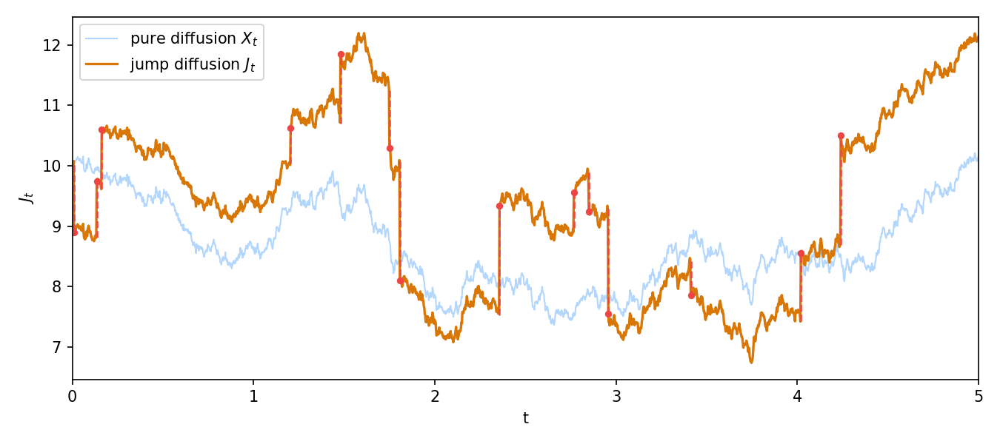

# Simple Jump Diffusion Monte Carlo Simulation

Monte Carlo simulation of jump diffusions (diffusions with jumps, cf. [1, Ch. VI]).



*One simulated path with its jumps marked in red, produced by the Quick start example below.*

## Structure



## Model

The jump diffusion $J$ with initial value $J_0 = x_0$ follows the dynamic

$$\mathrm{d}J_t = \mu(J_t) \mathrm{d}t + \sigma(J_t) \mathrm{d}W_t + \big(\rho(J_{t^-}, Y_{C_t}) - J_{t^-}\big) \mathrm{d}C_t$$

or, equivalently, in integral form

$$J_t = x_0 + \int_0^t \mu(J_s) \mathrm{d}s + \int_0^t \sigma(J_s) \mathrm{d}W_s + \int_0^t \big(\rho(J_{s^-}, Y_{C_s}) - J_{s^-}\big) \mathrm{d}C_s$$

where

- $\mu$ is the drift coefficient, a function from $\mathbb{R}$ to $\mathbb{R}$,
- $\sigma$ is the diffusion coefficient, a function from $\mathbb{R}$ to $(0, \infty)$,
- $W$ is a standard Brownian motion,
- $C$ is a counting process with jump times $\tau_1, \tau_2, \ldots$ and state-dependent intensity function $h$, i.e. jumps arrive at rate $h(J_t)$,
- $\rho$ is the function of jumps, a function from $\mathbb{R}^2$ to $\mathbb{R}$, i.e. the $k$-th jump takes the process from the pre-jump value $J_{\tau_k^-}$ to $\rho(J_{\tau_k^-}, Y_k)$,
- $Y_k$, $k = 1, 2, \ldots$, are i.i.d. random variables which determine the values of the jumps,
- $x_0 \in \mathbb{R}$ is the initial value.

## Quick start

```python
import numpy as np
from jump_diffusion import JumpDiffusion

JF = JumpDiffusion(mu=lambda x: 0.3, sigma=lambda x: 1.0, intensity=lambda x: 3.0,
                   rho=lambda x, y: x + y,
                   jump=lambda rng: (1 if rng.random() < 0.5 else -1) * rng.uniform(0.5, 2.0),
                   x0=10.0)

rng = np.random.default_rng(1)

# simulate and plot one path
sim = JF.simulate(T=5.0, n=2000, rng=rng)
sim.combined_plot()

# Monte Carlo estimate of E[J_T] from many paths
paths = JF.simulate_many(T=5.0, n=2000, n_paths=1000, rng=rng)
estimate, standard_error = JumpDiffusion.monte_carlo(paths)
```

## Example

A worked example notebook is available in the [examples for market making](https://github.com/patrickstreeb/examples-for-market-making/blob/main/simple_jump_diffusion_monte_carlo_simulation.ipynb) repository.

## Reference

[1] Borodin, A. N. (2017). *Stochastic Processes*. Probability and Its Applications. Birkhäuser/Springer International Publishing, Cham. https://doi.org/10.1007/978-3-319-62310-8
